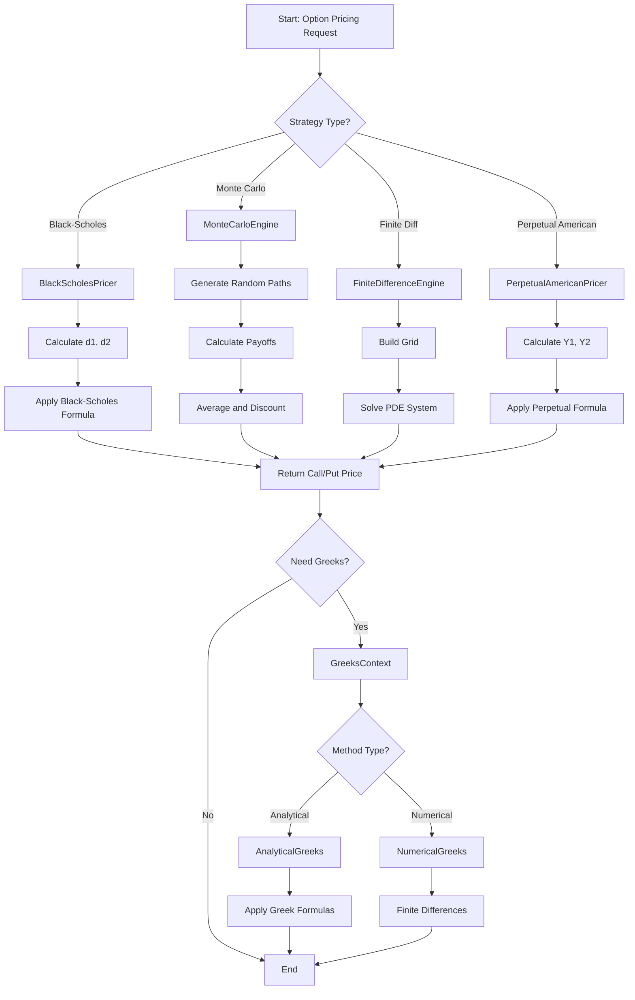

# Strategy Pattern Architecture für Level 9 Option Pricing

## ASCII UML Diagramm

```
┌─────────────────────────────────────────────────────────────────────────────────┐
│                           STRATEGY PATTERN ARCHITECTURE                         │
└─────────────────────────────────────────────────────────────────────────────────┘

┌─────────────────────────────────────────────────────────────────────────────────┐
│                                CONTEXT LAYER                                    │
├─────────────────────────────────────────────────────────────────────────────────┤
│                                                                                 │
│  ┌─────────────────────┐    ┌─────────────────────┐    ┌─────────────────────┐  │
│  │   OptionContext     │    │   GreeksContext     │    │   BatchProcessor    │  │
│  │                     │    │                     │    │                     │  │
│  │ - option: Option    │    │ - option: Option    │    │ - testBatches[]     │  │
│  │ - pricer: IPricer*  │    │ - calculator: IGreeks* │ │ + runAllTests()     │  │
│  │                     │    │                     │    │ + runMatrixTests()  │  │
│  │ + setStrategy()     │    │ + setStrategy()     │    │ + generateMesh()    │  │
│  │ + calculatePrice()  │    │ + calculateGreeks() │    │                     │  │
│  │ + verifyParity()    │    │                     │    │                     │  │
│  └─────────────────────┘    └─────────────────────┘    └─────────────────────┘  │
│                                                                                 │
└─────────────────────────────────────────────────────────────────────────────────┘
                                        │
                                        │ uses
                                        ▼
┌─────────────────────────────────────────────────────────────────────────────────┐
│                              STRATEGY INTERFACES                                │
├─────────────────────────────────────────────────────────────────────────────────┤
│                                                                                 │
│  ┌─────────────────────┐    ┌─────────────────────┐    ┌─────────────────────┐  │
│  │   IPricingStrategy  │    │  IGreeksCalculator  │    │   IParityValidator  │  │
│  │                     │    │                     │    │                     │  │
│  │ + calculateCall()   │    │ + calculateDelta()  │    │ + validateParity()  │  │
│  │ + calculatePut()    │    │ + calculateGamma()  │    │ + callFromPut()     │  │
│  │ + getName()         │    │ + calculateVega()   │    │ + putFromCall()     │  │
│  │                     │    │ + calculateTheta()  │    │                     │  │
│  └─────────────────────┘    └─────────────────────┘    └─────────────────────┘  │
│           ▲                           ▲                           ▲             │
└─────────────────────────────────────────────────────────────────────────────────┘
            │                           │                           │
            │                           │                           │
┌─────────────────────────────────────────────────────────────────────────────────┐
│                            CONCRETE STRATEGIES                                  │
├─────────────────────────────────────────────────────────────────────────────────┤
│                                                                                 │
│ ┌─────────────────────┐  ┌─────────────────────┐  ┌─────────────────────┐       │
│ │ BlackScholesPricer  │  │ MonteCarloEngine    │  │ FiniteDiffEngine    │       │
│ │                     │  │                     │  │                     │       │
│ │ + calculateCall()   │  │ + calculateCall()   │  │ + calculateCall()   │       │
│ │ + calculatePut()    │  │ + calculatePut()    │  │ + calculatePut()    │       │
│ │ - calculateD1()     │  │ - runSimulation()   │  │ - buildGrid()       │       │
│ │ - calculateD2()     │  │ - generatePaths()   │  │ - solveSystem()     │       │
│ │ - normalCDF()       │  │ - calculatePayoff() │  │                     │       │
│ └─────────────────────┘  └─────────────────────┘  └─────────────────────┘       │
│                                                                                 │
│ ┌─────────────────────┐  ┌─────────────────────┐  ┌─────────────────────┐       │
│ │PerpetualAmericanPricer│ │ AnalyticalGreeks   │  │ NumericalGreeks     │       │
│ │                     │  │                     │  │                     │       │
│ │ + calculateCall()   │  │ + calculateDelta()  │  │ + calculateDelta()  │       │
│ │ + calculatePut()    │  │ + calculateGamma()  │  │ + calculateGamma()  │       │
│ │ - calculateY1()     │  │ - normalPDF()       │  │ - finiteDifference()│       │
│ │ - calculateY2()     │  │                     │  │ - setStepSize()     │       │
│ └─────────────────────┘  └─────────────────────┘  └─────────────────────┘       │
│                                                                                 │
│                          ┌─────────────────────┐                               │
│                          │ PutCallParityValidator│                              │
│                          │                     │                               │
│                          │ + validateParity()  │                               │
│                          │ + callFromPut()     │                               │
│                          │ + putFromCall()     │                               │
│                          └─────────────────────┘                               │
└─────────────────────────────────────────────────────────────────────────────────┘
                                        │
                                        │ uses
                                        ▼
┌─────────────────────────────────────────────────────────────────────────────────┐
│                               DATA MODELS                                       │
├─────────────────────────────────────────────────────────────────────────────────┤
│                                                                                 │
│  ┌─────────────────────┐    ┌─────────────────────┐    ┌─────────────────────┐  │
│  │      Option         │    │   OptionParameters  │    │    TestBatch        │  │
│  │                     │    │                     │    │                     │  │
│  │ - T: double         │    │ - S_min, S_max      │    │ - name: string      │  │
│  │ - K: double         │    │ - meshSize: double   │    │ - option: Option    │  │
│  │ - sig: double       │    │ - parameterType     │    │ - expectedCall      │  │
│  │ - r: double         │    │                     │    │ - expectedPut       │  │
│  │ - S: double         │    │ + generateMesh()    │    │                     │  │
│  │                     │    │ + createMatrix()    │    │ + validate()        │  │
│  │ + validate()        │    │                     │    │                     │  │
│  │ + toString()        │    │                     │    │                     │  │
│  └─────────────────────┘    └─────────────────────┘    └─────────────────────┘  │
│                                                                                 │
└─────────────────────────────────────────────────────────────────────────────────┘
                                        │
                                        │ uses
                                        ▼
┌─────────────────────────────────────────────────────────────────────────────────┐
│                              UTILITY LAYER                                      │
├─────────────────────────────────────────────────────────────────────────────────┤
│                                                                                 │
│  ┌─────────────────────┐    ┌─────────────────────┐    ┌─────────────────────┐  │
│  │     MathUtils       │    │   MeshGenerator     │    │   ResultFormatter   │  │
│  │                     │    │                     │    │                     │  │
│  │ + normalCDF()       │    │ + generateRange()   │    │ + formatResults()   │  │
│  │ + normalPDF()       │    │ + createMatrix()    │    │ + printBatch()      │  │
│  │ + validateParams()  │    │ + meshArray()       │    │ + exportToExcel()   │  │
│  │                     │    │                     │    │                     │  │
│  └─────────────────────┘    └─────────────────────┘    └─────────────────────┘  │
│                                                                                 │
└─────────────────────────────────────────────────────────────────────────────────┘
```

## Detailliertes Klassendesign

### 1. Strategy Interfaces

#### 1.1 IPricingStrategy.hpp
```cpp
#ifndef IPRICING_STRATEGY_HPP
#define IPRICING_STRATEGY_HPP

#include "Option.hpp"

/**
 * @brief Interface für alle Option Pricing Strategien
 * 
 * Definiert das gemeinsame Interface für verschiedene Pricing-Methoden:
 * - Black-Scholes (exakte Lösung)
 * - Monte Carlo Simulation
 * - Finite Difference Method
 * - Perpetual American Options
 */
class IPricingStrategy
{
public:
    virtual ~IPricingStrategy() = default;
    
    // Hauptfunktionen für Option Pricing
    virtual double calculateCall(const Option& option) const = 0;
    virtual double calculatePut(const Option& option) const = 0;
    
    // Utility-Funktionen
    virtual std::string getName() const = 0;
    virtual bool supportsGreeks() const = 0;
    
    // Für Batch-Processing (Teil c & d der Homework)
    virtual std::vector<double> calculateCallVector(const std::vector<Option>& options) const;
    virtual std::vector<double> calculatePutVector(const std::vector<Option>& options) const;
    virtual std::vector<std::vector<double>> calculateCallMatrix(
        const std::vector<std::vector<Option>>& optionMatrix) const;
    virtual std::vector<std::vector<double>> calculatePutMatrix(
        const std::vector<std::vector<Option>>& optionMatrix) const;
};

#endif // IPRICING_STRATEGY_HPP
```

#### 1.2 IGreeksCalculator.hpp
```cpp
#ifndef IGREEKS_CALCULATOR_HPP
#define IGREEKS_CALCULATOR_HPP

#include "Option.hpp"

/**
 * @brief Interface für Greeks (Option Sensitivities) Berechnungen
 * 
 * Unterstützt sowohl analytische als auch numerische Methoden
 * für die Berechnung der Option Sensitivities.
 */
class IGreeksCalculator
{
public:
    virtual ~IGreeksCalculator() = default;
    
    // First-order Greeks
    virtual double calculateDelta(const Option& option, bool isCall = true) const = 0;
    virtual double calculateVega(const Option& option, bool isCall = true) const = 0;
    virtual double calculateTheta(const Option& option, bool isCall = true) const = 0;
    virtual double calculateRho(const Option& option, bool isCall = true) const = 0;
    
    // Second-order Greeks
    virtual double calculateGamma(const Option& option) const = 0;
    
    // Utility
    virtual std::string getMethodName() const = 0;
    virtual bool isNumerical() const = 0;
    
    // Für numerische Methoden
    virtual void setStepSize(double h) {}
};

#endif // IGREEKS_CALCULATOR_HPP
```

#### 1.3 IParityValidator.hpp
```cpp
#ifndef IPARITY_VALIDATOR_HPP
#define IPARITY_VALIDATOR_HPP

#include "Option.hpp"

/**
 * @brief Interface für Put-Call Parity Validierung und Berechnungen
 * 
 * Implementiert die Put-Call Parity Beziehung für Teil b) der Homework.
 */
class IParityValidator
{
public:
    virtual ~IParityValidator() = default;
    
    // Put-Call Parity Validierung
    virtual bool validateParity(const Option& option, double callPrice, 
                               double putPrice, double tolerance = 1e-6) const = 0;
    
    // Parity-basierte Preisberechnung
    virtual double callFromPut(const Option& option, double putPrice) const = 0;
    virtual double putFromCall(const Option& option, double callPrice) const = 0;
    
    // Utility
    virtual double calculateParityDifference(const Option& option, 
                                           double callPrice, double putPrice) const = 0;
};

#endif // IPARITY_VALIDATOR_HPP
```

### 2. Context Classes

#### 2.1 OptionContext.hpp
```cpp
#ifndef OPTION_CONTEXT_HPP
#define OPTION_CONTEXT_HPP

#include "IPricingStrategy.hpp"
#include "IParityValidator.hpp"
#include "Option.hpp"
#include <memory>

/**
 * @brief Haupt-Context Klasse für Option Pricing
 * 
 * Verwendet Strategy Pattern um verschiedene Pricing-Methoden
 * austauschbar zu machen. Zentrale Klasse für alle Pricing-Operationen.
 */
class OptionContext
{
public:
    // Konstruktoren
    OptionContext();
    OptionContext(std::unique_ptr<IPricingStrategy> strategy);
    
    // Strategy Management
    void setPricingStrategy(std::unique_ptr<IPricingStrategy> strategy);
    void setParityValidator(std::unique_ptr<IParityValidator> validator);
    
    // Single Option Pricing (Teil a)
    double calculateCall(const Option& option) const;
    double calculatePut(const Option& option) const;
    
    // Put-Call Parity (Teil b)
    bool verifyParity(const Option& option, double tolerance = 1e-6) const;
    double callFromPutParity(const Option& option, double putPrice) const;
    double putFromCallParity(const Option& option, double callPrice) const;
    
    // Vector Pricing (Teil c)
    std::vector<double> calculateCallVector(const std::vector<Option>& options) const;
    std::vector<double> calculatePutVector(const std::vector<Option>& options) const;
    
    // Matrix Pricing (Teil d)
    std::vector<std::vector<double>> calculateCallMatrix(
        const std::vector<std::vector<Option>>& optionMatrix) const;
    std::vector<std::vector<double>> calculatePutMatrix(
        const std::vector<std::vector<Option>>& optionMatrix) const;
    
    // Utility
    std::string getCurrentStrategyName() const;

private:
    std::unique_ptr<IPricingStrategy> pricingStrategy_;
    std::unique_ptr<IParityValidator> parityValidator_;
    
    void validateStrategy() const;
};

#endif // OPTION_CONTEXT_HPP
```

#### 2.2 GreeksContext.hpp
```cpp
#ifndef GREEKS_CONTEXT_HPP
#define GREEKS_CONTEXT_HPP

#include "IGreeksCalculator.hpp"
#include "Option.hpp"
#include <memory>

/**
 * @brief Context für Greeks (Option Sensitivities) Berechnungen
 * 
 * Ermöglicht Wechsel zwischen analytischen und numerischen Methoden
 * für die Berechnung der Option Sensitivities.
 */
class GreeksContext
{
public:
    // Konstruktoren
    GreeksContext();
    GreeksContext(std::unique_ptr<IGreeksCalculator> calculator);
    
    // Strategy Management
    void setCalculator(std::unique_ptr<IGreeksCalculator> calculator);
    
    // Single Greeks Calculation
    double calculateDelta(const Option& option, bool isCall = true) const;
    double calculateGamma(const Option& option) const;
    double calculateVega(const Option& option, bool isCall = true) const;
    double calculateTheta(const Option& option, bool isCall = true) const;
    double calculateRho(const Option& option, bool isCall = true) const;
    
    // Vector Greeks (für Teil b der Greeks-Aufgabe)
    std::vector<double> calculateDeltaVector(const std::vector<Option>& options, 
                                           bool isCall = true) const;
    std::vector<double> calculateGammaVector(const std::vector<Option>& options) const;
    
    // Matrix Greeks (für Teil c der Greeks-Aufgabe)
    std::vector<std::vector<double>> calculateDeltaMatrix(
        const std::vector<std::vector<Option>>& optionMatrix, bool isCall = true) const;
    std::vector<std::vector<double>> calculateGammaMatrix(
        const std::vector<std::vector<Option>>& optionMatrix) const;
    
    // Utility
    std::string getCurrentMethodName() const;
    bool isNumericalMethod() const;
    void setNumericalStepSize(double h);

private:
    std::unique_ptr<IGreeksCalculator> calculator_;
    
    void validateCalculator() const;
};

#endif // GREEKS_CONTEXT_HPP
```

### 3. Concrete Strategy Implementations

#### 3.1 BlackScholesPricer.hpp
```cpp
#ifndef BLACK_SCHOLES_PRICER_HPP
#define BLACK_SCHOLES_PRICER_HPP

#include "IPricingStrategy.hpp"

/**
 * @brief Black-Scholes exakte Pricing-Implementierung
 * 
 * Implementiert die klassischen Black-Scholes Formeln für
 * European Options. Hauptklasse für Teil a) der Homework.
 */
class BlackScholesPricer : public IPricingStrategy
{
public:
    // IPricingStrategy Implementation
    double calculateCall(const Option& option) const override;
    double calculatePut(const Option& option) const override;
    std::string getName() const override { return "Black-Scholes"; }
    bool supportsGreeks() const override { return true; }

private:
    // Black-Scholes Helper-Funktionen
    double calculateD1(const Option& option) const;
    double calculateD2(const Option& option) const;
    
    // Statistische Funktionen (mit Boost)
    double normalCDF(double x) const;
    double normalPDF(double x) const;
    
    // Validierung
    void validateOption(const Option& option) const;
    
    // Konstanten
    static constexpr double PI = 3.14159265358979323846;
    static constexpr double SQRT_2_PI = 2.50662827463100050241;
};

#endif // BLACK_SCHOLES_PRICER_HPP
```

#### 3.2 PerpetualAmericanPricer.hpp
```cpp
#ifndef PERPETUAL_AMERICAN_PRICER_HPP
#define PERPETUAL_AMERICAN_PRICER_HPP

#include "IPricingStrategy.hpp"

/**
 * @brief Perpetual American Options Pricer
 * 
 * Implementiert die exakten Formeln für Perpetual American Options
 * aus Teil B der Homework.
 */
class PerpetualAmericanPricer : public IPricingStrategy
{
public:
    // IPricingStrategy Implementation
    double calculateCall(const Option& option) const override;
    double calculatePut(const Option& option) const override;
    std::string getName() const override { return "Perpetual American"; }
    bool supportsGreeks() const override { return false; }

private:
    // Perpetual American Helper-Funktionen
    double calculateY1(const Option& option) const;
    double calculateY2(const Option& option) const;
    
    // Validierung
    void validateOption(const Option& option) const;
};

#endif // PERPETUAL_AMERICAN_PRICER_HPP
```

#### 3.3 AnalyticalGreeks.hpp
```cpp
#ifndef ANALYTICAL_GREEKS_HPP
#define ANALYTICAL_GREEKS_HPP

#include "IGreeksCalculator.hpp"

/**
 * @brief Analytische Greeks Berechnung
 * 
 * Implementiert die exakten Formeln für Option Sensitivities
 * basierend auf Black-Scholes Ableitungen.
 */
class AnalyticalGreeks : public IGreeksCalculator
{
public:
    // IGreeksCalculator Implementation
    double calculateDelta(const Option& option, bool isCall = true) const override;
    double calculateGamma(const Option& option) const override;
    double calculateVega(const Option& option, bool isCall = true) const override;
    double calculateTheta(const Option& option, bool isCall = true) const override;
    double calculateRho(const Option& option, bool isCall = true) const override;
    
    std::string getMethodName() const override { return "Analytical"; }
    bool isNumerical() const override { return false; }

private:
    // Helper-Funktionen (wiederverwendet von BlackScholesPricer)
    double calculateD1(const Option& option) const;
    double calculateD2(const Option& option) const;
    double normalCDF(double x) const;
    double normalPDF(double x) const;
};

#endif // ANALYTICAL_GREEKS_HPP
```

#### 3.4 NumericalGreeks.hpp
```cpp
#ifndef NUMERICAL_GREEKS_HPP
#define NUMERICAL_GREEKS_HPP

#include "IGreeksCalculator.hpp"
#include "IPricingStrategy.hpp"
#include <memory>

/**
 * @brief Numerische Greeks Berechnung mit Divided Differences
 * 
 * Implementiert numerische Approximation der Option Sensitivities
 * für Teil d) der Greeks-Aufgabe.
 */
class NumericalGreeks : public IGreeksCalculator
{
public:
    // Konstruktor
    explicit NumericalGreeks(std::shared_ptr<IPricingStrategy> pricer, double stepSize = 0.01);
    
    // IGreeksCalculator Implementation
    double calculateDelta(const Option& option, bool isCall = true) const override;
    double calculateGamma(const Option& option) const override;
    double calculateVega(const Option& option, bool isCall = true) const override;
    double calculateTheta(const Option& option, bool isCall = true) const override;
    double calculateRho(const Option& option, bool isCall = true) const override;
    
    std::string getMethodName() const override { return "Numerical (Divided Differences)"; }
    bool isNumerical() const override { return true; }
    void setStepSize(double h) override { stepSize_ = h; }

private:
    std::shared_ptr<IPricingStrategy> pricer_;
    double stepSize_;
    
    // Finite Difference Approximations
    double centralDifference(const Option& option, bool isCall, 
                           std::function<Option(const Option&, double)> parameterShift) const;
    double secondOrderDifference(const Option& option, bool isCall,
                               std::function<Option(const Option&, double)> parameterShift) const;
    
    // Parameter Shift Functions
    Option shiftSpot(const Option& option, double shift) const;
    Option shiftVolatility(const Option& option, double shift) const;
    Option shiftTime(const Option& option, double shift) const;
    Option shiftRate(const Option& option, double shift) const;
};

#endif // NUMERICAL_GREEKS_HPP
```

### 4. Data Models

#### 4.1 Option.hpp
```cpp
#ifndef OPTION_HPP
#define OPTION_HPP

#include <string>

/**
 * @brief Option Datenmodell
 * 
 * Kapselt alle Parameter für Option Pricing.
 * Einfache, erweiterbare Datenstruktur.
 */
class Option
{
public:
    // Konstruktoren
    Option();
    Option(double T, double K, double sig, double r, double S);
    Option(const Option& other) = default;
    Option& operator=(const Option& other) = default;
    
    // Getter
    double getTimeToMaturity() const { return T_; }
    double getStrike() const { return K_; }
    double getVolatility() const { return sig_; }
    double getRiskFreeRate() const { return r_; }
    double getSpotPrice() const { return S_; }
    
    // Setter (für Matrix-Pricing und Parameter-Variation)
    void setTimeToMaturity(double T) { T_ = T; validate(); }
    void setStrike(double K) { K_ = K; validate(); }
    void setVolatility(double sig) { sig_ = sig; validate(); }
    void setRiskFreeRate(double r) { r_ = r; validate(); }
    void setSpotPrice(double S) { S_ = S; validate(); }
    
    // Utility
    void updateAllParameters(double T, double K, double sig, double r, double S);
    bool isValid() const;
    std::string toString() const;
    
    // Operators
    bool operator==(const Option& other) const;
    bool operator!=(const Option& other) const;

private:
    double T_;    // Time to maturity
    double K_;    // Strike price
    double sig_;  // Volatility
    double r_;    // Risk-free rate
    double S_;    // Spot price
    
    void validate() const;
};

#endif // OPTION_HPP
```

#### 4.2 TestBatch.hpp
```cpp
#ifndef TEST_BATCH_HPP
#define TEST_BATCH_HPP

#include "Option.hpp"
#include <string>

/**
 * @brief Test Batch Datenstruktur
 * 
 * Kapselt Test-Daten aus der Homework mit erwarteten Ergebnissen
 * für Validierung der Implementierung.
 */
struct TestBatch
{
    std::string name;
    Option option;
    double expectedCallPrice;
    double expectedPutPrice;
    
    // Konstruktor
    TestBatch(const std::string& n, const Option& opt, 
              double callPrice, double putPrice)
        : name(n), option(opt), expectedCallPrice(callPrice), expectedPutPrice(putPrice) {}
    
    // Validierung
    bool validateResults(double calculatedCall, double calculatedPut, 
                        double tolerance = 1e-5) const;
    
    // Output
    std::string toString() const;
};

/**
 * @brief Test Data Factory
 * 
 * Erstellt alle Test-Batches aus der Homework.
 */
class TestDataFactory
{
public:
    // Homework Test Batches
    static TestBatch createBatch1();  // T=0.25, K=65, sig=0.30, r=0.08, S=60
    static TestBatch createBatch2();  // T=1.0, K=100, sig=0.2, r=0.0, S=100
    static TestBatch createBatch3();  // T=1.0, K=10, sig=0.50, r=0.12, S=5
    static TestBatch createBatch4();  // T=30.0, K=100.0, sig=0.30, r=0.08, S=100.0
    
    // Greeks Test Data
    static TestBatch createGreeksTestBatch();  // K=100, S=105, T=0.5, r=0.1, sig=0.36
    
    // Perpetual American Test Data
    static TestBatch createPerpetualTestBatch();  // K=100, sig=0.1, r=0.1, S=110
    
    // Alle Batches
    static std::vector<TestBatch> getAllTestBatches();
};

#endif // TEST_BATCH_HPP
```

### 5. Utility Classes

#### 5.1 MeshGenerator.hpp
```cpp
#ifndef MESH_GENERATOR_HPP
#define MESH_GENERATOR_HPP

#include "Option.hpp"
#include <vector>

/**
 * @brief Mesh Generation für Vector/Matrix Pricing
 * 
 * Erstellt Arrays und Matrizen von Options für Teil c) und d)
 * der Homework.
 */
class MeshGenerator
{
public:
    // Vector Generation (Teil c)
    static std::vector<double> generateRange(double start, double end, double step);
    static std::vector<Option> generateSpotPriceVector(const Option& baseOption, 
                                                      double startS, double endS, double stepS);
    
    // Matrix Generation (Teil d)
    static std::vector<std::vector<Option>> generateParameterMatrix(
        const Option& baseOption, 
        const std::vector<double>& param1Values,
        const std::vector<double>& param2Values,
        ParameterType param1Type,
        ParameterType param2Type);
    
    // Enums für Parameter-Typen
    enum class ParameterType {
        SPOT_PRICE,
        STRIKE,
        VOLATILITY,
        TIME_TO_MATURITY,
        RISK_FREE_RATE
    };

private:
    static Option updateParameter(const Option& option, double value, ParameterType paramType);
};

#endif // MESH_GENERATOR_HPP
```

### 6. Erweiterungspunkte für Homework-Teile

#### Implementierungsreihenfolge:

1. **Phase 1 - Grundlagen (Teil a)**
   - `Option` Datenmodell
   - `IPricingStrategy` Interface
   - `BlackScholesPricer` Implementation
   - `OptionContext` Basis-Funktionalität
   - `TestDataFactory` für Batches 1-4

2. **Phase 2 - Put-Call Parity (Teil b)**
   - `IParityValidator` Interface
   - `PutCallParityValidator` Implementation
   - Erweiterung von `OptionContext`

3. **Phase 3 - Vector Pricing (Teil c)**
   - `MeshGenerator` für Vector-Generation
   - Vector-Methoden in `IPricingStrategy`
   - Vector-Methoden in `OptionContext`

4. **Phase 4 - Matrix Pricing (Teil d)**
   - Matrix-Methoden in `MeshGenerator`
   - Matrix-Methoden in `IPricingStrategy`
   - Matrix-Methoden in `OptionContext`

5. **Phase 5 - Greeks (Option Sensitivities)**
   - `IGreeksCalculator` Interface
   - `AnalyticalGreeks` Implementation
   - `GreeksContext` Implementation
   - Integration mit Test-Daten

6. **Phase 6 - Numerische Greeks (Teil d der Greeks)**
   - `NumericalGreeks` Implementation
   - Divided Differences Algorithmen
   - Vergleich mit analytischen Ergebnissen

7. **Phase 7 - Perpetual American Options (Teil B)**
   - `PerpetualAmericanPricer` Implementation
   - Integration in `OptionContext`
   - Test mit Perpetual-Daten

8. **Phase 8 - Erweiterungen (Gruppen C&D)**
   - `MonteCarloEngine` Implementation
   - `FiniteDifferenceEngine` Implementation
   - Excel-Integration

### 7. Vorteile der Strategy Pattern Architecture

#### 7.1 Flexibilität
- **Austauschbare Algorithmen**: Verschiedene Pricing-Methoden können zur Laufzeit gewechselt werden
- **Einfache Erweiterung**: Neue Pricing-Strategien implementieren nur das Interface
- **Konsistente API**: Alle Pricing-Methoden haben dasselbe Interface

#### 7.2 Testbarkeit
- **Isolierte Tests**: Jede Strategy kann unabhängig getestet werden
- **Mock-Strategien**: Einfache Erstellung von Test-Doubles
- **Batch-Testing**: Konsistente Test-Struktur für alle Methoden

#### 7.3 Wartbarkeit
- **Klare Trennung**: Algorithmus-Logik getrennt von Context-Logik
- **Single Responsibility**: Jede Klasse hat eine klar definierte Aufgabe
- **Open/Closed Principle**: Erweiterbar ohne Änderung bestehender Klassen

#### 7.4 Erweiterbarkeit für Homework
- **Schrittweise Implementierung**: Jeder Homework-Teil baut auf dem vorherigen auf
- **Wiederverwendung**: Gemeinsame Komponenten (Option, MathUtils) für alle Teile
- **Zukunftssicher**: Vorbereitet für Monte Carlo, FDM und weitere Methoden

### 8. Implementierungsbeispiele

#### 8.1 Verwendung für Teil a) - Basic Pricing
```cpp
#include "OptionContext.hpp"
#include "BlackScholesPricer.hpp"
#include "TestDataFactory.hpp"

int main() {
    // Context mit Black-Scholes Strategy erstellen
    OptionContext context(std::make_unique<BlackScholesPricer>());
    
    // Test Batch 1 laden
    auto batch1 = TestDataFactory::createBatch1();
    
    // Preise berechnen
    double callPrice = context.calculateCall(batch1.option);
    double putPrice = context.calculatePut(batch1.option);
    
    // Ergebnisse validieren
    bool isValid = batch1.validateResults(callPrice, putPrice);
    
    std::cout << "Batch 1 Results:" << std::endl;
    std::cout << "Call Price: " << callPrice << " (Expected: " << batch1.expectedCallPrice << ")" << std::endl;
    std::cout << "Put Price: " << putPrice << " (Expected: " << batch1.expectedPutPrice << ")" << std::endl;
    std::cout << "Validation: " << (isValid ? "PASSED" : "FAILED") << std::endl;
    
    return 0;
}
```

#### 8.2 Verwendung für Teil b) - Put-Call Parity
```cpp
#include "OptionContext.hpp"
#include "BlackScholesPricer.hpp"
#include "PutCallParityValidator.hpp"

int main() {
    // Context mit Strategien konfigurieren
    OptionContext context(std::make_unique<BlackScholesPricer>());
    context.setParityValidator(std::make_unique<PutCallParityValidator>());
    
    auto batch = TestDataFactory::createBatch1();
    
    // Direkte Preisberechnung
    double directCall = context.calculateCall(batch.option);
    double directPut = context.calculatePut(batch.option);
    
    // Parity-basierte Berechnung
    double parityCall = context.callFromPutParity(batch.option, directPut);
    double parityPut = context.putFromCallParity(batch.option, directCall);
    
    // Parity-Validierung
    bool parityValid = context.verifyParity(batch.option);
    
    std::cout << "Put-Call Parity Analysis:" << std::endl;
    std::cout << "Direct Call: " << directCall << ", Parity Call: " << parityCall << std::endl;
    std::cout << "Direct Put: " << directPut << ", Parity Put: " << parityPut << std::endl;
    std::cout << "Parity Valid: " << (parityValid ? "YES" : "NO") << std::endl;
    
    return 0;
}
```

#### 8.3 Verwendung für Teil c) - Vector Pricing
```cpp
#include "OptionContext.hpp"
#include "BlackScholesPricer.hpp"
#include "MeshGenerator.hpp"

int main() {
    OptionContext context(std::make_unique<BlackScholesPricer>());
    
    // Basis-Option aus Batch 1
    auto baseOption = TestDataFactory::createBatch1().option;
    
    // Vector von Spot-Preisen generieren (10, 11, 12, ..., 50)
    auto optionVector = MeshGenerator::generateSpotPriceVector(baseOption, 10.0, 50.0, 1.0);
    
    // Vector Pricing
    auto callPrices = context.calculateCallVector(optionVector);
    auto putPrices = context.calculatePutVector(optionVector);
    
    // Ergebnisse ausgeben
    std::cout << "Vector Pricing Results:" << std::endl;
    for (size_t i = 0; i < optionVector.size(); ++i) {
        std::cout << "S=" << optionVector[i].getSpotPrice() 
                  << ", Call=" << callPrices[i] 
                  << ", Put=" << putPrices[i] << std::endl;
    }
    
    return 0;
}
```

#### 8.4 Verwendung für Greeks
```cpp
#include "GreeksContext.hpp"
#include "AnalyticalGreeks.hpp"
#include "NumericalGreeks.hpp"
#include "BlackScholesPricer.hpp"

int main() {
    // Analytische Greeks
    GreeksContext analyticalContext(std::make_unique<AnalyticalGreeks>());
    
    // Numerische Greeks
    auto pricer = std::make_shared<BlackScholesPricer>();
    GreeksContext numericalContext(std::make_unique<NumericalGreeks>(pricer, 0.01));
    
    auto testOption = TestDataFactory::createGreeksTestBatch().option;
    
    // Greeks berechnen
    double analyticalDelta = analyticalContext.calculateDelta(testOption, true);
    double numericalDelta = numericalContext.calculateDelta(testOption, true);
    
    double analyticalGamma = analyticalContext.calculateGamma(testOption);
    double numericalGamma = numericalContext.calculateGamma(testOption);
    
    std::cout << "Greeks Comparison:" << std::endl;
    std::cout << "Delta - Analytical: " << analyticalDelta << ", Numerical: " << numericalDelta << std::endl;
    std::cout << "Gamma - Analytical: " << analyticalGamma << ", Numerical: " << numericalGamma << std::endl;
    
    return 0;
}
```

### 9. Dateistruktur

```
src/level_9/
├── interfaces/
│   ├── IPricingStrategy.hpp
│   ├── IGreeksCalculator.hpp
│   └── IParityValidator.hpp
├── context/
│   ├── OptionContext.hpp
│   ├── OptionContext.cpp
│   ├── GreeksContext.hpp
│   └── GreeksContext.cpp
├── strategies/
│   ├── BlackScholesPricer.hpp
│   ├── BlackScholesPricer.cpp
│   ├── PerpetualAmericanPricer.hpp
│   ├── PerpetualAmericanPricer.cpp
│   ├── MonteCarloEngine.hpp          // Für später
│   └── FiniteDifferenceEngine.hpp    // Für später
├── greeks/
│   ├── AnalyticalGreeks.hpp
│   ├── AnalyticalGreeks.cpp
│   ├── NumericalGreeks.hpp
│   └── NumericalGreeks.cpp
├── validators/
│   ├── PutCallParityValidator.hpp
│   └── PutCallParityValidator.cpp
├── data/
│   ├── Option.hpp
│   ├── Option.cpp
│   ├── TestBatch.hpp
│   └── TestDataFactory.cpp
├── utils/
│   ├── MathUtils.hpp
│   ├── MathUtils.cpp
│   ├── MeshGenerator.hpp
│   ├── MeshGenerator.cpp
│   ├── ResultFormatter.hpp
│   └── ResultFormatter.cpp
├── CMakeLists.txt
└── main.cpp
```

### 10. Mermaid Workflow Diagramm



### 11. Nächste Schritte

1. **Sofortiger Start**: Implementierung von `Option` Klasse und `IPricingStrategy` Interface
2. **Erste Funktionalität**: `BlackScholesPricer` für Teil a) der Homework
3. **Iterative Erweiterung**: Schrittweise Hinzufügung weiterer Strategien
4. **Kontinuierliche Tests**: Validierung mit Homework Test-Batches
5. **Dokumentation**: Detaillierte Kommentierung aller Klassen

### 12. Zusammenfassung

Diese Strategy Pattern Architecture bietet:

- **Modulare Struktur**: Klare Trennung zwischen Datenmodellen, Strategien und Context
- **Erweiterbarkeit**: Einfache Integration neuer Pricing-Methoden
- **Testbarkeit**: Isolierte Komponenten für Unit-Tests
- **Wiederverwendbarkeit**: Gemeinsame Interfaces für alle Strategien
- **Skalierbarkeit**: Vorbereitet für komplexe Homework-Anforderungen

Die Architektur unterstützt alle Teile der Level 9 Homework:
- ✅ Teil a) Basic Black-Scholes Pricing
- ✅ Teil b) Put-Call Parity
- ✅ Teil c) Vector Pricing
- ✅ Teil d) Matrix Pricing
- ✅ Greeks (analytisch und numerisch)
- ✅ Perpetual American Options
- ✅ Erweiterungen für Monte Carlo und FDM

**Bereit für die Implementierung!**
4. **Phase 